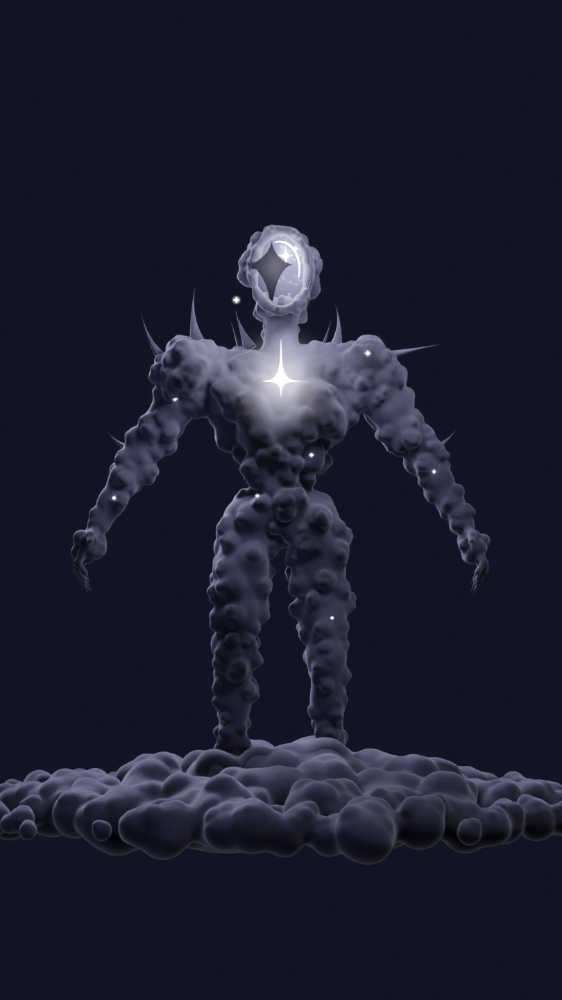
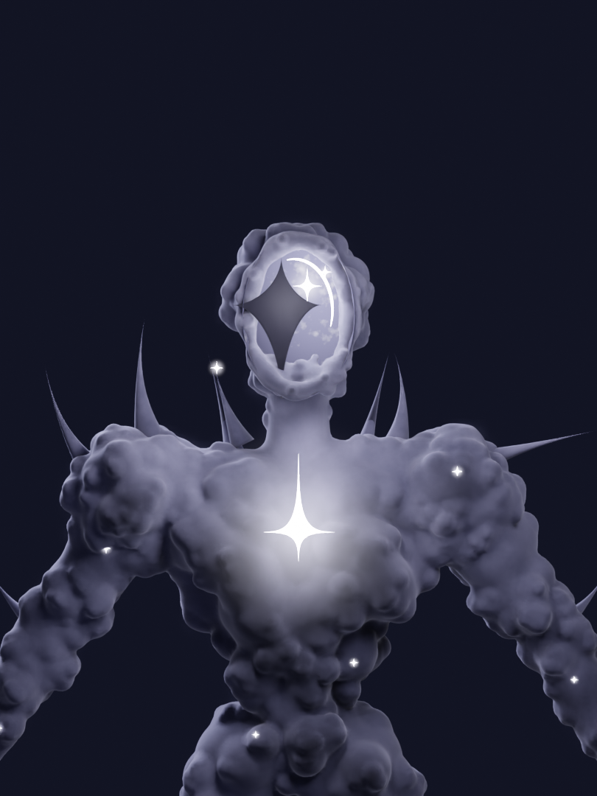

# Cloud Titan — бұлттан жаралған алып

Үш референстегі (бас, мойын, иық) кейіпкердің **толық денелі** 3D нұсқасы, Blender үшін.

| Толық дене (`Cam_Full`, 9:16) | Портрет (`Cam_Portrait`, 3:4) |
|---|---|
|  |  |

## Файлдар

- `cloud_titan.blend`: дайын сахна. Ашып, бірден рендер жасауға болады.
- `cloud_titan.py`: бүкіл фигураны нөлден құратын процедуралық скрипт.
- `renders/`: алдын ала қарауға арналған суреттер (Cycles, 64 sample, 75%).

## Дене қалай ойластырылды

Суреттерде тек бас, мойын және иық көрінеді, қалғанын солардың стилінде жалғастырдым:

- **Бас**: жоғарыдан кең, иекке қарай жіңішкеретін жұмыртқа пішіні. Бет жоқ, оның орнында ішінен жарқыраған бұлтты аспанға ашылған «терезе» бар. Терезеде үлкен қара төрт сәулелі жұлдыз тұр, оның төменгі сәулесі мойынға дейін созылады. Жанында жарық жұлдыз және ай орағы тәрізді доға бар.
- **Мойын**: ұзын әрі жіңішке.
- **Иық**: кең, бұлт шоқтарынан құралған. Иықтан, арқадан және шынтақтан иілген тікенектер шығып тұр.
- **Кеуде**: төсте ұзын тік сәулелі жарық жұлдыз бар.
- **Қол мен аяқ**: батырлық пропорция (биіктігі шамамен 18 м). Қолдары бұлттан, саусақ ұштарында қара тырнақ-тікенектер бар. Аяқ астында бұлт теңізі жатыр.
- **Дене бетінде** ұсақ жыпылықтаған жұлдыздар шашылған.

## Сахнадағы объектілер (`CloudTitan` коллекциясы)

| Объект | Не үшін |
|---|---|
| `Titan_Body` | Бұлт-дене (≈150k полигон), `Titan_Rig`-ке байланған |
| `Titan_FaceVoid` | Беттегі жарқыраған аспан (emission, анимацияланған бұлт) |
| `Titan_StarEye` | Үлкен қара жұлдыз |
| `Titan_Crescent` | Беттегі жарық доға |
| `Titan_Sparkle_*` (+`_Glow`) | Жұлдыздар, жыпылықтайды |
| `Titan_Thorn_*`, `Titan_Claw_*` | Тікенектер мен тырнақтар |
| `Titan_Wisps` | Дене айналасындағы жұқа түтін (Volume) |
| `Titan_CloudBase` | Аяқ астындағы бұлттар |
| `Titan_Rig` | Қаңқа: hips, spine, chest, neck, head, shoulder/upper_arm/forearm/hand, thigh/shin/foot (.L/.R) |
| `Cam_Full`, `Cam_Portrait` | Екі камера |

## Анимация (1–300 кадр, 30 fps)

- Бұлттың текстурасы мен беттегі аспан баяу «қайнайды» (`#frame` драйверлері).
- Жұлдыздар жыпылықтайды.
- Қаңқада циклді «тыныс алу» анимациясы бар: кеуде кеңейеді, бас сәл көтеріледі. Pose Mode-та өз анимацияңызды үстінен қоса беруге болады.

## Скриптті қайта іске қосу және баптау

Blender ішінде: **Scripting → Open → `cloud_titan.py` → Run Script**. Скрипт `CloudTitan` коллекциясын қайта құрады.

Терминалдан:

```bash
blender -b -P cloud_titan.py -- --save cloud_titan.blend
blender -b -P cloud_titan.py -- --render renders/ --scale 100 --samples 128
```

Файлдың басындағы негізгі баптаулар:

| Параметр | Мәні |
|---|---|
| `SEED` | Басқа сан берсеңіз, бұлттардың басқа нұсқасы шығады |
| `MB_RESOLUTION` | Бұлттың егжей-тегжейі. `0.04` нәзігірек, бірақ ауыр |
| `PUFF_DENSITY` | Бұлт бүрлерінің тығыздығы |
| `ADD_WISPS` | Көлемді түтін. Рендерді баяулатады, тез превью үшін `False` қойыңыз |
| `ADD_CLOUD_BASE`, `ADD_RIG` | Бұлт теңізі мен қаңқаны қосу/өшіру |
| `COL_*` | Палитра |
| `J` сөздігі | Буындардың орны, яғни дене пропорциясы мен позасы |

Тексерілген нұсқа: Blender 5.1. Скрипт 4.2+ нұсқалармен үйлесімді болатындай жазылған. Рендер Cycles-ке бапталған, EEVEE-де де ашылады.
